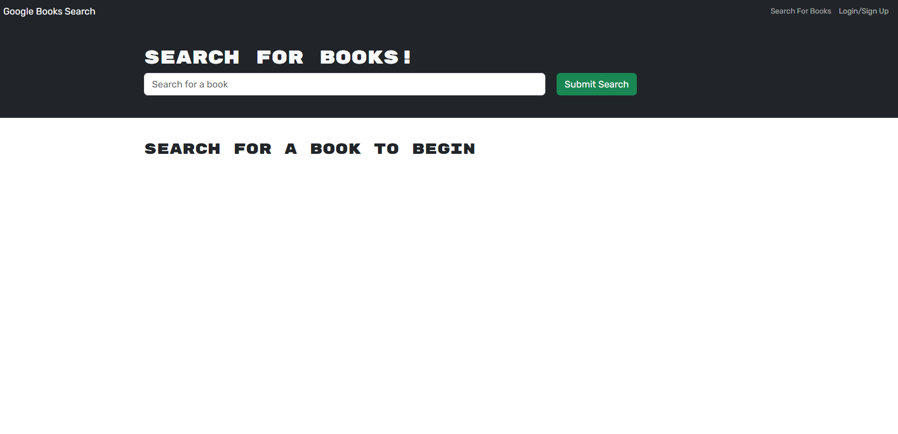

# book-search

  ## Description
  This project is a website that uses MongoDB to save serached books to be viewed later in a users profile. My motivation was to make an application that allowed users to look through books and save the ones that looked interesting to them for later. This application allows the user to click on books that they have searched and read a description and save them if they are logged in. I have learned that using ReMongoDB to create a database for an applications is a great way to stay organized and have clean and well structured websites that allow saved and logged in features.

  ## Table of Contents
- [Usage](#usage)
- [Contribution](#contribution)
- [Tests](#tests)
- [License](#license)
- [Questions](#questions)

## Usage

The best way to use this application is to go to the launched URL and view the pages of the website and test all the functions like the login and the saved books feature.

## Contribution

Used the example code, html and css files provided by the OSU coding bootcamp.

https://git.bootcampcontent.com/Ohio-State-University/OSU-VIRT-FSF-PT-01-2024-U-LOLC

## Tests

This can be tested by going to the launched URL and checking all functions work as they should!

https://book-search-uvvq.onrender.com/

## License
This project is licensed under the [MIT License](https://opensource.org/licenses/MIT).

## Questions
For any questions, please contact [DakotaPatterson](https://github.com/kk) or email dakota.patterson19@yahoo.com.